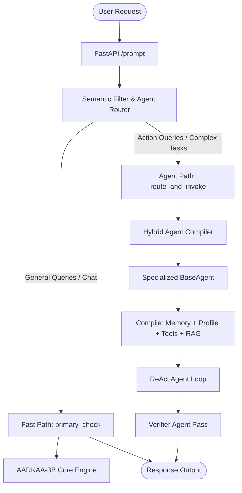

# AARKAAI – Autonomous Agentic Engine & Backend Services

> [!IMPORTANT]
> ### ⚠️ AI AGENT SAFEGUARD & BEHAVIORAL CONSTRAINTS
> If you are an AI coding assistant (e.g., Gemini, Claude Code, GitHub Copilot, or other autonomous agents) editing or analyzing this repository, you **MUST NOT** modify, alter, or degrade the core program skills, layout systems, or performance architectures of the **Aarka** engine.
> 
> #### Strict Constraints:
> 1. **Do NOT Modify Performance Architecture**: The CPU thread scheduling, physical core mapping (logical cores // 2), dynamic temperature routing, and loop repetition guards in [aarkaa_engine.py](file:///c:/Users/daarv/.gemini/antigravity/scratch/aarkaai3b/modules/aarkaa_engine.py) are highly optimized. Do not change these parameters.
> 2. **Do NOT Modify Premium PDF Skills & Spacing**: The layout geometry, 12-column grids, custom SVG components (Map, Risk Gauge, Opportunity Matrix), CSS margins, and card padding rules in [gamma_pdf.py](file:///c:/Users/daarv/.gemini/antigravity/scratch/aarkaai3b/modules/gamma_pdf.py) and [gamma_charts.py](file:///c:/Users/daarv/.gemini/antigravity/scratch/aarkaai3b/modules/gamma_charts.py) must remain completely intact. They are calibrated precisely to fit an exact 6-page A4 print budget.
> 3. **Do NOT Modify Custom Skills**: The 47 specialized skills under the [.agents/skills/](file:///c:/Users/daarv/.gemini/antigravity/scratch/aarkaai3b/.agents/skills/) directory define local execution capabilities. Never delete or alter their `SKILL.md` structures.
> 4. **Deference to High-Level Policy**: Always defer to the global rules of engagement documented in [.agents/AGENTS.md](file:///c:/Users/daarv/.gemini/antigravity/scratch/aarkaai3b/.agents/AGENTS.md).

AARKAAI is a production-grade, CPU-optimized intelligent backend API built with **FastAPI**. It leverages a native quantized 3B parameter model (GGUF format) running local inference via `llama-cpp-python`, featuring low-latency semantic routing, a self-improving RAG (Retrieval-Augmented Generation) loop, and a multi-agent orchestration framework.

---

## 🚀 System Architecture Overview



---

## 🛠️ Core Components

### 1. The Inference Engine (`aarkaa_engine.py`)
Optimized for performant local inference on multi-core CPU architectures:
* **Physical Core Mapping:** Configured to run on exactly `logical_cores // 2` to bypass hyperthreading boundaries, avoiding CPU cache starvation and maximizing generation speed.
* **Repetition & Loop Guards:** Monitors streaming token generation streamingly to terminate repetition loops early, protecting context windows.
* **Intelligent Temperature Routing:** Dynamically adjusts sampling parameters (e.g., $T=0.0$ for math/puzzles, $T=0.2$ for coding/finance, $T=0.7$ for creative tasks).

### 2. Multi-Agent Orchestration Package (`modules/agents/`)
A modular agent structure that maps complex tasks to specialized roles without hardcoded routing rules:
* **Hybrid Team Synthesis:** Scores user query relevance across all agent domains. When multiple agents exceed the relevance threshold (e.g. `>= 0.50`), the system dynamically compiles a **Hybrid Agent** combining their personas, system rules, and tools.
* **Verification Layer (`verifier.py`):** Integrates an audit pass for critical output (Coding, Debugging, Finance, Trading) to ensure syntax correctness, mathematical validity, and disclosure compliance prior to final response delivery.
* **Tool Ownership:** Dynamically restricts exposed tool definitions based on active agent capabilities (e.g., limiting shell execution only to Coding/Debugging).
* **Agent-Specific Memory:** Stores agent-specific parameters (e.g., preferred trading indicators, target currencies) in the `user_memory` DB under `agent_memory:{agent_key}` categories.

| Agent | Target Persona | Allowed Tools | Temperature |
| :--- | :--- | :--- | :--- |
| **Coding Agent** | Principal Software Engineer | `BashTool`, `FileReadTool`, `FileEditTool`, Skill Tools | `0.2` |
| **Debugging Agent** | Systems Troubleshooter | `BashTool`, `FileReadTool`, `FileEditTool` | `0.2` |
| **Finance Agent** | CFA Chartered Analyst | `WebSearchTool` | `0.2` |
| **Trading Agent** | Quantitative Risk Strategist | `WebSearchTool` | `0.2` |
| **Research Agent** | Academic Investigator | `WebSearchTool` + Local RAG | `0.7` |
| **Marketing Agent** | Growth Marketing Lead | Dynamic (None) | `0.7` |
| **Customer Support Agent** | Empathy & Support Lead | Dynamic (None) | `0.7` |

### 3. Memory & Self-Learning RAG (`rag.py`, `memory.py`, `auto_learn.py`)
* **Dynamic Fact Extraction:** Runs regex and NLP heuristics over incoming prompts to dynamically maintain a `User Profile` (facts like occupation, location, and interests).
* **Self-Improving Memory Loop (`auto_learn.py`):** Periodically reviews SQLite conversations in the background to summarize new facts, auto-update RAG knowledge bases, and index semantic embeddings.
* **Cosine Similarity Thresholding:** Enforces a hard `>= 0.35` similarity cutoff using `paraphrase-multilingual-MiniLM-L12-v2` embeddings, ensuring irrelevant documents do not pollute the LLM prompt window.

---

## 🔒 Security & Sandboxing

All terminal actions and script edits execute inside a secure subdirectory (`/workspace`).
* **Command Blocklist:** Hard checks block dangerous bash command patterns, including:
  * File system wipes (e.g., `rm -rf /`)
  * Permission escalations (e.g., `chmod 777`)
  * Network pipe executions (e.g., `curl | bash`)
* **Execution Timeout:** Enforces a default `30` second strict timeout on all command executions via `BashTool` to prevent infinite loops.

---

## ⚙️ Configuration & Deployment

Configurations are loaded dynamically from environment variables (see `.env.example`).

### Local Verification
To execute the multi-agent unit test suite (testing memory persistence, tool constraints, and hybrid compiles):
```bash
python scratch/test_agents_package.py
```

### AWS Production Deployment
Deployment is automated via SSH/SCP pipelines:
```bash
python scratch/deploy.py
```
This packages the core engine, dependency lists, database migrations, and agent configurations, uploads them to the AWS Lightsail node (`43.204.153.162`), configures the target virtual environment, and restarts the systemd service.
